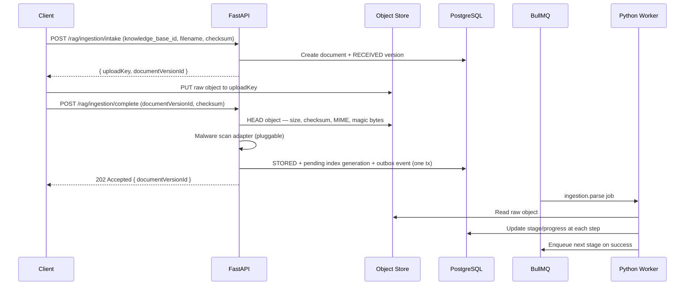

# Ingestion Architecture

Complete flow for the offline knowledge plane: how source material enters the
system, is validated, parsed, normalized, chunked, embedded, and published into
a retrievable index — including the human review gate before chunking proceeds.

---

## Status overview

| Layer | Status |
|---|---|
| Platform foundation (Qdrant, MinIO, catalog tables, provider ports) | **Ready** |
| Tenant-scoped document identity and versioning | **Ready** |
| Two-phase presigned upload intake | **Ready** |
| Docling parser adapter (PDF, Markdown, plain text) | **Ready** |
| Normalization and quality gate | **Ready** |
| Human review gate (`NEEDS_REVIEW` state + approval endpoint) | **Ready** |
| Sidebar badge counter for pending review | **Ready** |
| Structure-aware parent-child chunking | **Ready** |
| Dense + sparse embedding and Qdrant publication | **Ready** |
| Generation-safe atomic index promotion | **Ready** |
| Python BullMQ worker consolidation (10 queues, single process) | **Ready** |
| Retry from checkpoint / reindex | **Ready** |
| Soft delete + async purge | **Ready** |
| Status and progress APIs | **Ready** |
| Connectors (web crawl, S3 pull, CDC, email, Git) | **Not implemented** — Phase D |
| Scanned PDF / image OCR | **Not implemented** — deferred |
| DOCX / PPTX / XLSX / HTML formats | **Not implemented** — deferred |
| Code-AST parser | **Not implemented** — deferred |
| Table extraction (isolated chunking) | **Not implemented** — deferred |
| Graph projection from ingestion | **Not implemented** — Phase E |
| Malware scanner adapter (pluggable) | **Interface defined, no adapter** |
| Multimodal (image evidence) | **Not implemented** — Phase E |

---

## 1. Architecture decisions

| Concern | Decision | Reason |
|---|---|---|
| Metadata and lifecycle | PostgreSQL | Source of truth for identity, versioning, lineage, ACL, and audit |
| Raw files and parser artifacts | S3-compatible object store (MinIO default) | Binary blobs do not belong in a relational or vector DB |
| Vector index | Qdrant | Docker-friendly, payload filtering, named vectors, hybrid query, RRF |
| Job orchestration | Python BullMQ worker (`python-bullmq 3.0.4`) | Single process, proper lifecycle (retry/backoff/DLQ), no internal HTTP round-trips |
| Parser | Docling adapter behind `DocumentParser` port | Provider-neutral, local-first, layout-aware, supports PDF/MD/TXT in v1 |
| Human review gate | `NEEDS_REVIEW` lifecycle state + explicit approval step | Prevents low-quality extractions from silently becoming retrievable |
| Chunk identity | Deterministic SHA-256 of version + path + offsets + chunker version | Retries never create duplicate vectors |
| Index publication | Saga + outbox — new generation pending until validation passes | No retrieval gap during updates; prior version stays active until promotion |

---

## 2. End-to-end flow

```
Client
  │
  ▼
POST /rag/ingestion/intake          ← create pending document version, get upload key
  │
  ▼
Object Store (MinIO / S3)           ← client uploads directly, API never buffers file
  │
  ▼
POST /rag/ingestion/complete        ← HEAD validation: size, checksum, MIME, magic bytes
  │                                    malware scan adapter (pluggable)
  ▼
PostgreSQL                          ← STORED state + outbox event in one transaction
  │
  ▼
BullMQ ingestion.intake queue
  │
  ▼
Worker: PARSING stage
  │   DoclingParserAdapter → ordered DocumentElement[]
  │   artifacts saved to object store (raw, parser, page images)
  │
  ▼
Worker: NORMALIZING stage
  │   Unicode + whitespace normalization
  │   header/footer/boilerplate removal
  │   language detection
  │   exact + near-duplicate detection
  │   secret/PII signal detection
  │
  ▼
Quality gate
  ├── pass  → CLASSIFYING stage
  └── fail  → NEEDS_REVIEW (pipeline pauses, badge shown in sidebar)
               Human approves or rejects via UI / API
               Approved → CLASSIFYING continues
               Rejected → REJECTED terminal state
  │
  ▼
Worker: CLASSIFYING stage
  │   ACL projection from source connector policy
  │   PII/classification tagging
  │
  ▼
Worker: CHUNKING stage
  │   Structure-aware parent-child chunking
  │   (see section 6 for strategy)
  │   Deterministic chunk IDs
  │
  ▼
Worker: EMBEDDING stage
  │   Dense embedding (EmbeddingProfile, batched, content-addressed cache)
  │   Sparse encoding (SPLADE-style)
  │   Vector validation (dimension, NaN check)
  │
  ▼
Worker: INDEXING stage
  │   Qdrant upsert with generation ID and mandatory payload
  │   Graph projection (optional, deferred Phase E)
  │
  ▼
Worker: VALIDATING stage
  │   Compare manifest counts, vector counts, checksums
  │   Sample retrieval probe
  │   Promote generation in PostgreSQL transaction
  │   Prior active version kept until cleanup grace period
  │
  ▼
READY — available for retrieval
```

---

## 3. Lifecycle state machine

```
[*] → RECEIVED → STORED → QUEUED → PARSING → NORMALIZING → CLASSIFYING
    → CHUNKING → EMBEDDING → INDEXING → VALIDATING → READY

RECEIVED   → REJECTED        (validation failure at intake)
PARSING    → FAILED          (parse error after bounded retries)
NORMALIZING → NEEDS_REVIEW   (quality gate fail)
NORMALIZING → FAILED         (after bounded retries)
CLASSIFYING → FAILED
CHUNKING   → FAILED
EMBEDDING  → FAILED
INDEXING   → FAILED
VALIDATING → FAILED

NEEDS_REVIEW → CLASSIFYING   (human approved)
NEEDS_REVIEW → REJECTED      (human rejected)

FAILED     → QUEUED          (operator retry from checkpoint)

READY      → SUPERSEDED      (newer active version promoted)
READY      → DELETING        (soft delete requested)
SUPERSEDED → DELETING
DELETING   → DELETED         (async purge complete: Qdrant, artifacts, cache)
```

Only `READY` versions are visible to retrieval. A new version is promoted
atomically — the prior version remains active until the new generation passes
full validation. This prevents retrieval gaps during updates.

---

## 4. Intake and upload flow



Enforced limits at intake (configurable):

| Check | Default |
|---|---|
| Supported MIME types | `application/pdf`, `text/markdown`, `text/plain` |
| Maximum file size | 50 MB |
| Maximum PDF pages | 500 |
| Unsupported MIME | Rejected before upload key is issued |

---

## 5. Human review gate

After normalization, the quality gate scores each document version:

| Signal | Description |
|---|---|
| `text_coverage` | Ratio of pages/elements with extracted text |
| `ocr_confidence` | Average confidence from layout model |
| `invalid_char_ratio` | Ratio of non-printable or garbled characters |
| `empty_element_ratio` | Ratio of elements with no usable text |
| `page_coverage` | Pages successfully parsed vs total pages |
| `duplicate_ratio` | Near-duplicate content ratio |
| `language_confidence` | Detected language confidence score |

When any signal falls below its configured threshold, the version transitions
to `NEEDS_REVIEW` and the pipeline pauses.

### Review endpoints

| Endpoint | Description |
|---|---|
| `GET /rag/ingestion/pending-review/count` | Count of `NEEDS_REVIEW` versions for the tenant — used by sidebar badge |
| `GET /rag/ingestion/documents` | List documents, filterable by `lifecycle_state=NEEDS_REVIEW` |
| `POST /rag/ingestion/{id}/approve` | Approve and continue pipeline from CLASSIFYING |
| `POST /rag/ingestion/{id}/reject` | Reject — moves to REJECTED terminal state |
| `GET /rag/ingestion/status/{id}` | Current state and quality signals |

The sidebar badge polls `pending-review/count` every 30 seconds and displays a
red counter on the Documents nav item when count > 0.

### What happens at approval

The operator sees the quality signals and source metadata. On approval:
1. Version transitions `NEEDS_REVIEW → CLASSIFYING`.
2. BullMQ enqueues the classify job for this `documentVersionId`.
3. Pipeline continues normally.

On rejection:
1. Version transitions `NEEDS_REVIEW → REJECTED`.
2. No further processing. Source artifact is retained for audit.

---

## 6. Parser routing

Parser selection is driven by MIME type and magic-byte inspection, not file
extension alone.

| Content | v1 adapter | Status | Fallback |
|---|---|---|---|
| Digital PDF | DoclingParserAdapter | **Ready** | `hi_res` mode (deferred) |
| Markdown | DoclingParserAdapter | **Ready** | — |
| Plain text | DoclingParserAdapter | **Ready** | — |
| Scanned PDF / image OCR | — | **Deferred** | Docling OCR mode |
| DOCX / PPTX / XLSX | — | **Deferred** | Docling (supported by library) |
| HTML / email / EPUB | — | **Deferred** | Docling (supported by library) |
| Code (AST-aware) | — | **Deferred** | Language parser adapter |
| Audio/video transcript | — | **Not planned v1** | — |

Parser output is not a raw string. The canonical output is an ordered list of
`DocumentElement` records:

```
DocumentElement
├── id                  deterministic SHA-256 (version + index + page + text)
├── type                title | narrative | list | table | image | code | formula
├── text
├── page
├── bounding_box
├── hierarchy_path      heading ancestry (e.g. "3 / 3.1 / 3.1.2")
├── source_offsets      byte/char range in source
├── structured_payload  table grids, code language, etc.
└── extraction_confidence
```

Parser artifacts (raw, parsed elements, normalized, quality summary) are
written to the tenant object namespace so chunking can be retried without
re-running the parser or OCR.

---

## 7. Normalization and quality gate

Normalization steps applied to every document:

- Unicode NFC normalization and whitespace cleanup
- Header, footer, and boilerplate detection and removal
- Language detection (stored as `language` metadata)
- Broken hyphen and reading-order repair (for PDFs)
- Canonical URL and source metadata extraction
- Exact and near-duplicate fingerprint detection
- Table structure normalization
- Secret/PII signal detection and classification tagging

Quality gate computes a per-document score. Documents below threshold go to
`NEEDS_REVIEW` rather than silently becoming READY with empty or garbled content.

---

## 8. Chunking strategy

Chunking is content-profile-driven — not a single global text splitter.

### Default: structure-aware parent-child

```
Document
└── Parent chunk (~1,000–2,000 tokens)    section/page context, not directly embedded
    └── Child chunk (300–500 tokens)      retrieval unit, embedded and indexed
        └── Leaf (optional)               sentence / table-row / code-symbol
```

Token budgets use the embedding model's tokenizer, not character count.

| Limit | Value |
|---|---|
| Preferred child size | 300–500 tokens |
| Hard maximum child | 700 tokens |
| Parent context | 1,000–2,000 tokens |
| Overlap | Only when an element must be split (no global overlap) |

Hard structural boundaries are never crossed:

- Markdown heading boundaries
- PDF title/layout section boundaries
- Paragraph and list boundaries
- Code block boundaries (never split mid-block)
- Table boundaries (tables are isolated chunks)

### Strategy by content type

| Content | Strategy | Status |
|---|---|---|
| Narrative documents | Title/section-aware, semantic boundary fallback | **Ready** |
| Policy / manuals | Parent-child with heading and numbered clause hierarchy | **Ready** |
| FAQ | One question-answer unit, related topic as parent | **Ready** |
| Tables | Table isolated; header repeated; row-group children | **Deferred** |
| Code | Repository → file → class/function/symbol | **Deferred** |
| Transcripts | Speaker/time-window chunks with adjacent context | **Deferred** |
| Structured rows | Schema-aware text representation per record | **Deferred** |

Advanced strategies (late chunking, semantic chunking, multi-vector) are
feature flags. They are only activated when evaluation benchmarks show
improvement without latency or cost regressions.

### Chunk identity

Every chunk ID is a deterministic SHA-256 of:
```
document_version_id + hierarchy_path + source_offsets + chunker_version
```

Retries and reindexes are safe — they produce the same IDs and upsert rather
than duplicate.

---

## 9. Metadata enrichment

Enrichment runs after chunking and is split by source:

| Category | Fields | Source |
|---|---|---|
| Deterministic | title, page, headings, source, author, dates, MIME, checksum | Parser output |
| Policy | tenant_id, knowledge_base_id, acl_principals, classification, retention | Tenant + connector config |
| Derived | language, keywords, topics, entities, temporal expressions | NLP / detection |
| Relational | parent_chunk_id, prev_chunk_id, next_chunk_id, document_version_id | Chunker |
| Model-generated | summary, hypothetical questions, entity relations | LLM (feature flag) |

Model-generated metadata stores provider, model version, prompt version,
confidence, and generation timestamp. It never replaces source facts.

---

## 10. Embedding and sparse representation

`EmbeddingProfile` (versioned, immutable) defines:

- Provider and model identifier
- Vector dimension and distance metric
- Input prefix/template
- Tokenizer and maximum token length
- Dense / sparse / multi-vector mode
- Normalization flag
- Profile version

Batching rules:

- Content-addressed cache (chunk checksum + embedding profile version)
- Bounded by token count and item count per batch
- Provider rate limiter
- Retry partial failures without duplicating successful embeddings
- Reject vectors with wrong dimension or NaN values
- Record provider usage and latency metrics per batch

Qdrant collection layout: one collection per compatible embedding profile,
not one per tenant. Tenant and knowledge base are partitioned by payload.

Named vectors per point:

| Name | Purpose |
|---|---|
| `dense` | Semantic dense embedding |
| `sparse` | Lexical sparse vector (SPLADE-style) |
| `late` | Optional multi-vector / ColBERT (Phase E) |

---

## 11. Qdrant payload and required indexes

Every point carries the following indexed payload fields:

```
tenant_id               (keyword, indexed)
knowledge_base_id       (keyword, indexed)
document_id             (keyword)
document_version_id     (keyword, indexed)
chunk_id                (keyword)
parent_chunk_id         (keyword)
source_type             (keyword)
language                (keyword)
classification          (keyword, indexed)
acl_principals          (keyword[], indexed)
created_at              (datetime)
effective_from          (datetime)
effective_to            (datetime, nullable)
is_active               (bool, indexed)
generation_id           (keyword, indexed)
```

`tenant_id`, `knowledge_base_id`, `document_version_id`, `classification`,
`acl_principals`, `is_active`, and `generation_id` must have payload indexes
created before data is uploaded. All retrieval queries apply a mandatory
server-built filter on these fields.

---

## 12. Atomic index publication (saga)

PostgreSQL, object store, and Qdrant have no shared distributed transaction.
The pipeline uses a saga + outbox pattern:

```
1. PostgreSQL: create pending index generation (one tx with outbox event)
2. Worker: write parser and chunk artifacts to object store
3. Worker: upsert Qdrant vectors with pending generation_id
4. Validator: compare manifest chunk count == Qdrant point count
5. Validator: checksum sample retrieval probe
6. PostgreSQL tx: promote generation to ACTIVE, set prior to SUPERSEDED
7. Retrieval filter switches to active generation_id
8. Cleanup job (async, grace period): delete prior generation vectors
```

Failed generations remain in `PENDING` or `FAILED` state. They never replace
the active generation. The worker runs compensating cleanup for failed
generations.

---

## 13. BullMQ queue topology

All stages run inside a single Python worker process (`apps/api/app/workers/`).

| Queue | Concurrency | Description |
|---|---|---|
| `ingestion.parse` | configurable | Run DoclingParserAdapter, store artifacts |
| `ingestion.normalize` | configurable | Normalization + quality gate |
| `ingestion.classify` | configurable | ACL projection + PII tagging |
| `ingestion.chunk` | configurable | Structure-aware chunking |
| `ingestion.embed` | configurable | Dense + sparse embedding |
| `ingestion.index` | configurable | Qdrant upsert with generation ID |
| `ingestion.validate` | configurable | Manifest validation + generation promotion |
| `ingestion.cleanup` | 1 | Async purge of superseded generations |
| `graph.project` | configurable | Optional graph projection (Phase E) |
| `memory.summarize` | 3 | Conversation memory summarization |
| `memory.prune` | 1 | Expired memory pruning |

Job payload contains only IDs and references — never raw file content or
chunk text. All jobs carry `tenant_id`, `document_version_id`, and
`ingestion_run_id` for checkpoint recovery.

Retry policy: 3 attempts, exponential backoff starting at 5 seconds.
Dead-letter jobs retain stage, sanitized error, retry count, config snapshot,
and source manifest so operators can retry from the correct checkpoint.

---

## 14. Idempotency and versioning

Identity fields are separated by purpose:

| Field | Scope |
|---|---|
| `document_id` | Stable logical identity across versions |
| `document_version_id` | One immutable revision of the source bytes |
| `source_revision` | ETag, commit SHA, row version, or remote updated_at |
| `content_checksum` | SHA-256 of raw source bytes |
| `pipeline_fingerprint` | parser + normalizer + chunker + embedder + sparse encoder versions |
| `chunk_id` | Deterministic hash of version + hierarchy path + offsets + chunker version |
| `generation_id` | One complete index projection of a document version |

Deduplication rules:

| Condition | Outcome |
|---|---|
| Same checksum + same pipeline fingerprint | `NO_OP` — skip all stages |
| Checksum changed | New `document_version_id` |
| Pipeline changed, same checksum | New `generation_id` from same version bytes |
| Source deleted | Soft delete immediately; async purge cleans all projections |
| Retry within a stage | Idempotency key per stage — no duplicate vectors |

---

## 15. Security and ACL

- Tenant and knowledge-base authorization checked at intake before an upload
  key is issued.
- Source files and parser output are treated as untrusted input throughout.
- Secrets and PII detected during normalization are tagged and never flow into
  chunk text or vector payload without explicit policy.
- Object store download requires short-lived signed URLs and a policy check.
- Hard delete removes: raw object, all parser artifacts, all Qdrant vectors,
  graph nodes/edges, cache entries, and retained traces — subject to retention
  policy.
- Every ingestion run records actor, tenant, knowledge base, pipeline config
  snapshot, stage outcomes, and trace IDs in the audit log.

---

## 16. Observability

Every `IngestionRun` records:

| Metric | Description |
|---|---|
| `stage_latency_ms` | Latency per pipeline stage |
| `page_count` | Pages processed by parser |
| `element_count` | DocumentElements extracted |
| `chunk_count` | Child chunks created |
| `token_usage` | Embedding token count and cost |
| `embedding_latency_ms` | Provider embedding latency |
| `dedup_ratio` | Fraction of near-duplicate content |
| `quality_score` | Quality gate composite score |
| `retry_count` | Stage-level retries |
| `failure_stage` | Which stage failed (if any) |
| `vector_count` | Qdrant points upserted |
| `generation_id` | Active generation after promotion |

---

## 17. Failure handling

| Failure | Behavior |
|---|---|
| Parser timeout | Bounded retry, then fallback parser strategy or `NEEDS_REVIEW` |
| Normalization error | Retry, then `NEEDS_REVIEW` for operator decision |
| Quality gate fail | `NEEDS_REVIEW` — pipeline pauses, human approval required |
| Embedding partial failure | Retry only failed batch; do not re-embed successful chunks |
| Qdrant unavailable | Keep generation `PENDING`; do not promote |
| Qdrant dimension mismatch | Fail stage; alert operator — profile incompatibility |
| Validation count mismatch | Keep generation `FAILED`; do not promote |
| Delete purge failure | Keep tombstone active; retry purge asynchronously |
| Dead-letter job | Retain sanitized error + config snapshot; operator retries from checkpoint |

---

## 18. Module boundaries

```
apps/api/app/
├── domain/
│   └── rag/
│       ├── ingestion.py        document, version, chunk, quality, pipeline entities
│       └── adapter_ports.py    DocumentParser, ObjectStore, EmbeddingProvider, SparseEncoder
├── application/
│   └── ingestion_intake_service.py   orchestrate intake, validate, enqueue, approve/reject
├── infrastructure/
│   ├── rag_catalog.py          SQLAlchemy ORM models + repositories
│   ├── rag/
│   │   ├── parsers/
│   │   │   └── docling_adapter.py
│   │   ├── object_store/
│   │   │   ├── local_adapter.py
│   │   │   └── s3_adapter.py
│   │   └── embeddings/
│   │       └── (provider adapters)
└── workers/
    ├── main.py                 single Python BullMQ worker entrypoint
    └── ingestion_worker.py     stage handlers + worker factories

apps/web/
└── hooks/transactions/use-rag-ingestion/
    ├── use-ingestion-intake.ts
    ├── use-ingestion-status.ts
    ├── use-ingestion-documents.ts
    └── use-needs-review-count.ts   polls badge count every 30s
```

Domain and application layers must not import Docling, S3, Qdrant, or any
provider SDK. All SDKs live exclusively in infrastructure adapters.

---

## 19. Not implemented (explicit scope boundaries)

| Feature | Phase | Notes |
|---|---|---|
| Connectors (web crawl, S3 pull, CDC, email, Git) | Phase D | Requires connector registry + scheduler |
| Scanned PDF / image OCR | Deferred | Docling OCR mode available when enabled |
| DOCX / PPTX / XLSX / HTML | Deferred | Docling supports; blocked by format-extension change |
| Code-AST chunking | Deferred | Requires language parser adapter separate from Docling |
| Table isolation and row-group chunking | Deferred | Chunking strategy extension |
| Graph projection from ingestion | Phase E | Optional adapter; benchmark before enabling |
| Multimodal evidence (images, charts) | Phase E | Requires multimodal embedding profile |
| Automatic PII redaction | Deferred | Detection is in place; redaction policy is not |
| Malware scanner adapter | Interface defined | No concrete adapter; pluggable by operator |
| Semantic / late chunking | Phase E | Feature flag; only after evaluation shows improvement |

---

## 20. References

- `docs/RAG-ARCHITECTURE.md` — complete system overview, data model, and delivery phases
- `docs/RAG-PLATFORM-OPERATIONS.md` — runtime config, health/readiness, backup/restore
- `docs/TENANT-DEPLOYMENT.md` — tenant bootstrap and immutability rules
- `openspec/changes/archive/2026-08-03-rag-ingestion-foundation/` — ingestion foundation specs
- `openspec/changes/archive/2026-08-03-rag-docling-parser-adapter/` — parser adapter specs
- `openspec/changes/archive/2026-08-03-rag-platform-foundation/` — catalog and provider ports
- `openspec/changes/ingestion-review-badge/` — review gate badge (active change)
- `openspec/changes/worker-consolidation/` — Python BullMQ worker (active change)
